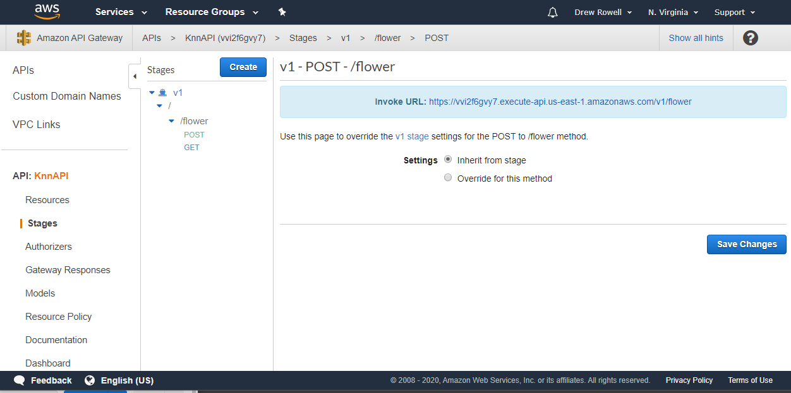

# KnnAPI
Serverless REST API for KNN-based Model Building

Creates an API Gateway endpoint which can be used to add training data, and then query a model.

Currently set up to use the [Iris Data Set](https://en.wikipedia.org/wiki/Iris_flower_data_set).

# Deploying
1. Replace all `knnapi-andrew` with your unique bucket name.
2. Create the bucket with `aws s3api create-bucket --bucket <YOUR BUCKET NAME> --acl private`.
3. Zip the lambda executables with `zip lambda.zip addflower.py testflower.py`.
4. Upload the lambda with `aws s3 cp lambda.zip s3://<YOUR_BUCKET_NAME>/lambda.zip`.
5. Deploy the CFT with `sam build && sam deploy --guided`

# Using
## Adding a flower to the database
1. Find your API endpoint in the aws console.

2. Make a POST http request like `https://<ENDPOINT>/flower?petal_length=14&petal_width=18&sepal_length=15&sepal_width=18&species=0`

## Files
* lambda/addflower.py - Lambda to add data to DynamoDB.
* template.yml - CFT for api, lambdas, and database.
* s3_setup.sh - creates s3 bucket for lambda zip.
* lambda/testflower.py - Lambda to estimate species from a flower's data.
* upload_lambda.sh - zips lambda scripts and uploads them to the s3 bucket.
* iris_data.csv - CSV file of the [Iris Data Set](https://en.wikipedia.org/wiki/Iris_flower_data_set)
* upload_data.py - Python script to upload training data.
* test_data.py - Sends requests to test accuracy of model built from uploaded data.

## To Do
* Make setup easier.
* Generalize beyond Iris data.
* Add more to Readme intro to explain what this all does.
